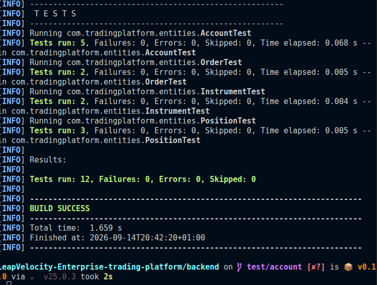

# Entity Tests

These tests check the current domain entity classes in `com.leapvelocity.entities`.

They are **unit tests**, not integration tests. They create entity objects directly in memory and check simple Java behavior such as constructors, getters, setters, validation, and calculation methods.

## What These Tests Cover

- `AccountTest`
  - account constructor defaults
  - `credit`
  - `debit`
  - insufficient balance validation
  - negative amount validation

- `InstrumentTest`
  - constructor values
  - tradable flag behavior

- `OrderTest`
  - order constructor values
  - default `OrderStatus.NEW`
  - status update behavior

- `PositionTest`
  - applying a trade to update quantity and average cost
  - market value calculation
  - null argument validation

## What These Tests Do Not Cover

These tests do not check database persistence. The entities use `jakarta.persistence` annotations, but these tests do not start Hibernate, Spring, or a database.

That is intentional for this skeleton. The current goal is to verify the Core Java behavior of the entity classes without changing teammate-created entity code.

## Test Types In This Project

- Unit tests: current tests in this folder. They test one class directly and run fast.
- Integration tests: future tests that would check JPA/Hibernate/database behavior.
- Spring tests: future tests that would start a Spring application context, if Spring Boot is added later.

## How To Run

From the project root:

```bash
mvn clean test
```

Use `clean` after moving or renaming packages so Maven removes stale compiled classes from `target`.

