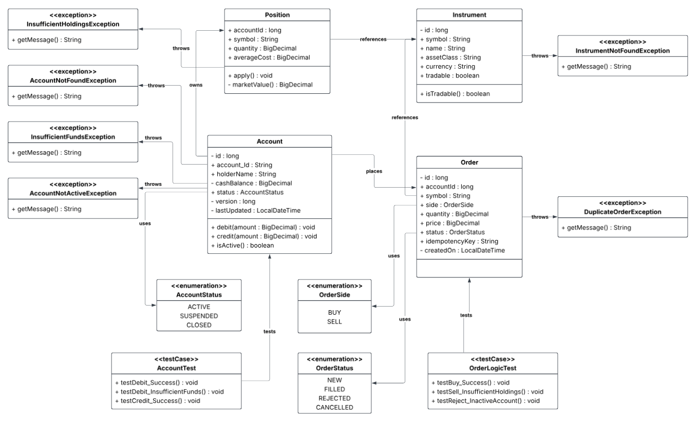
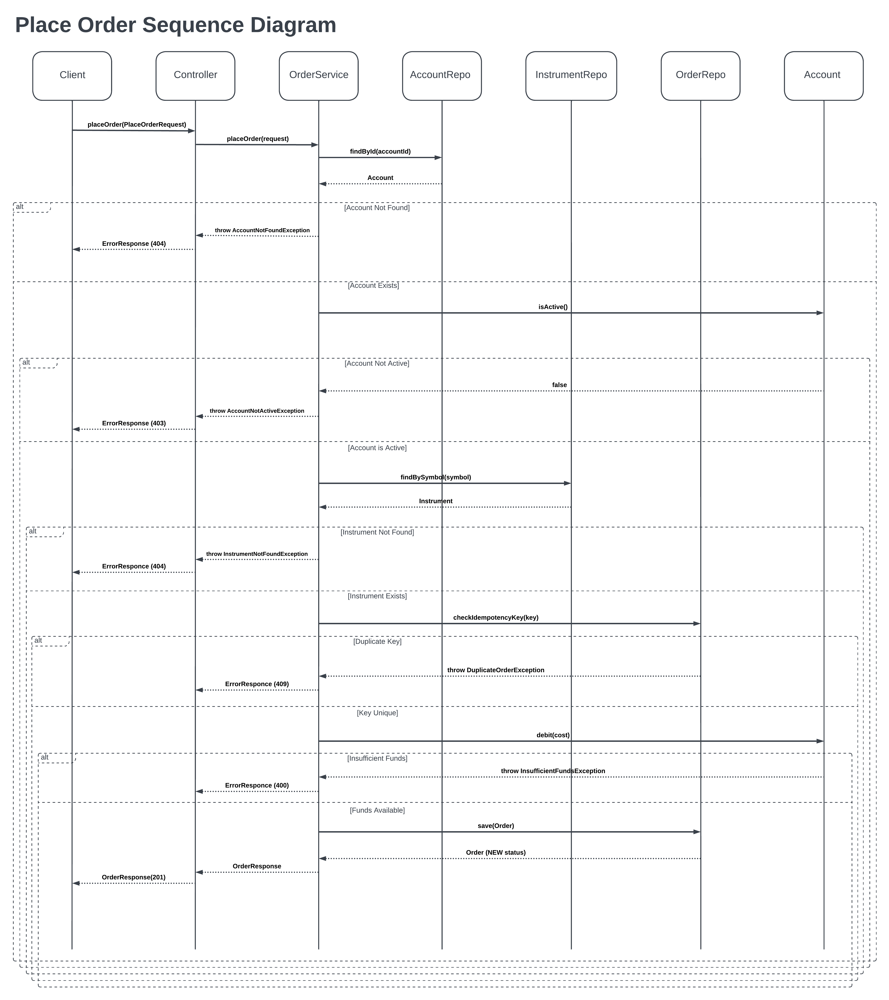
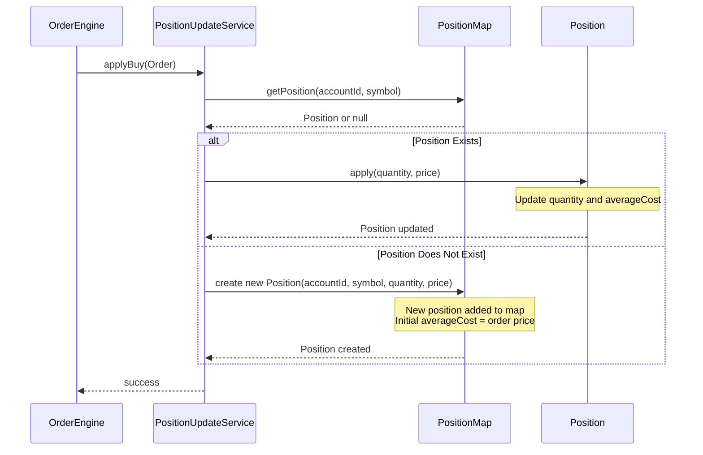
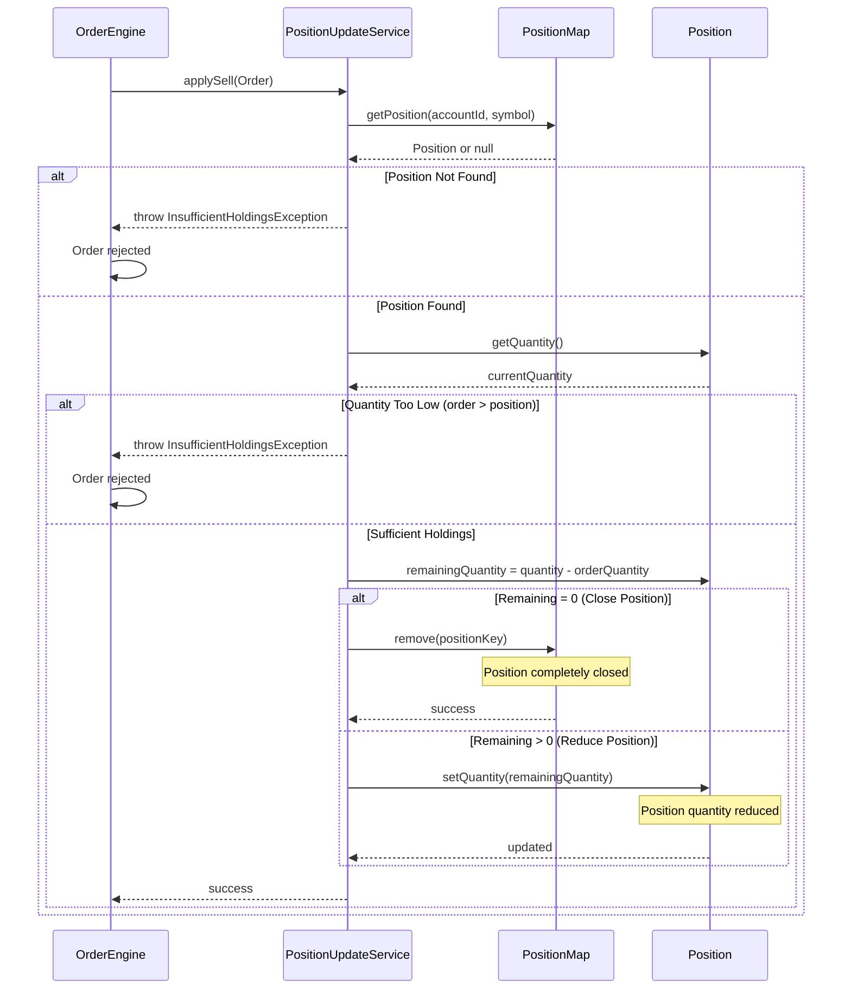

# Domain Model - Capstone Project - Leap Velocity
## 1. Core Entities

### Account
- **Purpose**: Represents a trading account
- **Key Attributes**:
    - id (unique identifier)
    - accountId (id of the account)
    - owner (user information)
    - balance (current cash balance)
    - status (ACTIVE, INACTIVE, FROZEN)
- **Key Responsibilities**:
    - Manage cash balance
    - Track account status
    - Record transaction history

---

### Instrument
- **Purpose**: Represents a tradable security/asset
- **Key Attributes**: 
    - symbol (unique trading symbol)
    - name (full name)
    - instrumentType (STOCK, CRYPTO, ETF)
    - currentPrice
- **Key Responsibilities**:
    - Store instrument metadata
    - Track pricing information

---

### Order
- **Purpose**: Represents a trading order
- **Key Attributes**: 
    - orderId (unique identifier)
    - accountId (reference to Account)
    - symbol (reference to Instrument)
    - side (BUY, SELL)
    - quantity
    - price
    - status (PENDING, FILLED, CANCELLED)
    - timestamp

- **Key Responsibilities**:
    - Track order lifecycle
    - Maintain order state

---

### Position
- **Purpose**: Represents current holdings in an instrument
- **Key Attributes**:
    - positionId (unique identifier)
    - accountId (reference to Account)
    - symbol (reference to Instrument)
    - quantity (current holdings)
    - averageCost
    - lastUpdatedTime
- **Key Responsibilities**:
    - Track current holdings
    - Calculate cost basis
    - Maintain position state

## 2. Class Diagram

## 3. Entity Relationships

**Account → Order**
- **Cardinality**: One-to-Many
- **Description**: An account places multiple orders
- **Constraints**: Order must reference valid Account

**Account → Position**
- **Cardinality**: One-to-Many
- **Description**: An account holds multiple positions
- **Constraints**: Account must be ACTIVE

**Order → Instrument**
- **Cardinality**: Many-to-One
- **Description**: Multiple orders can trade an instument
- **Constraints**: Instrument must exist

**Position → Instrument**
- **Cardinality**: Many-to-One
- **Description**: Multiple accounts can hold positions in same instrument

## 4. Business Rules & Invariants

1. **Account Balance**: Cannot be negative
2. **Active Account Required**: Only ACTIVE accounts can place orders
3. **Quantity Validation**: Must be > 0
4. **Idempotency**: Same orderId cannot be processed twice
5. **Sufficient Funds**: Account must have cash for BUY orders
6. **Instrument Validation**: Symbol must exist in system

## 5. Enumerations

**AccountStatus**
- ACTIVE
- SUSPENDED
- CLOSED

**OrderStatus**
- NEW
- FILLED
- REJECTED
- CANCELLED

**OrderSide**
- BUY 
- SELL

## 6. Sequence Diagrams

### Place Order Flow

## Position Update on Buy Order Sequence Diagram

Apply buy order to position - either creates new position or updates existing holdings

## Position Update on Sell Order Sequence Diagram

Apply sell order to position - reduces holdings or closes position if quantity reaches zero

## 7. Database Schema Notes

- Account ↔ ACCOUNTS table
- Instrument ↔ INSTRUMENTS table
- Order ↔ ORDERS table
- Position ↔ POSITIONS table